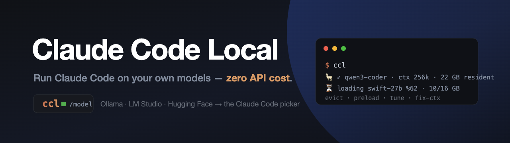

<p align="center">
  
</p>

<p align="center">
  
  
  
  
  
  
  
</p>

# Claude Code Local (`ccl`)

Run the official **Claude Code** CLI against your own **local models** — anything in Ollama, LM
Studio, or a GGUF from Hugging Face — at **zero API cost**.

`ccl` is a thin wrapper around the real `claude` binary, started in an **isolated profile**
(`~/.claude-isvalorum`). Your normal Claude Code (Anthropic) stays 100% untouched — same binary,
separate config, separate model list.

```bash
ccl                       # start Claude Code on your default local model
# inside Claude Code:
/model                    # pick any local model; the old one is evicted, the new one loads
```

## Why this exists

Pointing Claude Code at a local model is the easy part — a tiny proxy does it, and recent Ollama
even speaks the Anthropic Messages API natively. What nobody handles is the **local-model
lifecycle**: the plumbing that makes local models actually pleasant to use on a single machine with
finite unified memory. That's the whole point of `ccl`.

### What `ccl` adds that a plain proxy doesn't

1. **Instant VRAM eviction on model switch.** Pick a model with `/model` and the previous one is
   unloaded from memory and the new one is loaded *right then* — not on your next message. On Apple
   Silicon's shared memory that's the difference between "works" and "swap storm".
2. **Automatic context variants.** Claude Code's opening prompt is ~26–46k tokens, so a model loaded
   at the usual 32k context rejects your very first message. `ccl --fix-ctx` generates `-ctx128k`
   variants (weights shared — **no extra disk**) and lists them in `/model` in place of the ones
   that can't fit.
3. **A live status line + a settings panel.** The bottom line shows load %, prompt-processing and
   generating state, the model's context, how much memory it needs vs. what's free, and — when a
   turn is slow — the cheapest knob to speed it up. `ccl --tune` is an LM-Studio-style panel that
   persists those knobs where they actually take effect (see [Architecture](docs/ARCHITECTURE.md)).

Plus: measured tok/s and first-token time shown in the `/model` list, one-command model import from
LM Studio / Hugging Face, and automatic sync into [opencode](https://github.com/sst/opencode).

## Requirements

- **macOS** (Apple Silicon recommended — unified-memory eviction is where this earns its keep)
- [**Claude Code**](https://docs.claude.com/en/docs/claude-code) CLI installed and on `PATH`
- [**Ollama**](https://ollama.com) running locally
- **Python 3** — standard library only, no `pip install`

## Install

```bash
git clone https://github.com/nsozturk/claude-code-local.git
cd claude-code-local
bash scripts/install-symlinks.sh      # puts ccl (+ legacy cci) on ~/.local/bin
ccl                                    # first run syncs your Ollama models into the picker
```

## Usage

| Command | What it does |
|---|---|
| `ccl` | Start Claude Code on your default local model |
| `ccl -m <model>` | Use a specific model **for this session only** (your saved default is untouched) |
| `ccl --list` | Show local models + what's loaded in RAM/VRAM |
| `ccl --tune [model]` | LM-Studio-style panel: context, GPU offload, threads, Flash Attention, KV-cache type |
| `ccl --fix-ctx` | Make `-ctx128k` variants of models whose context is too small for Claude Code |
| `ccl --unload` | Evict all models from memory now |
| `ccl --update` | Update Claude Code, then verify the `/model` picker still lists local models |
| `ccl --doctor` | Just run that verification |
| `ccl --bridge {status\|restart\|stop}` | Manage the translation bridge daemon |
| `/model` (inside Claude Code) | Switch models; the previous one is evicted, the new one preloads |
| `/find-model <keywords>` (inside Claude Code) | Search Hugging Face for a GGUF model by keyword and import it |

### Importing a model

```bash
python3 scripts/import-model.py --list-lmstudio                 # what LM Studio already has
python3 scripts/import-model.py ~/.lmstudio/models/.../model.gguf   # import a local GGUF (no re-download)
python3 scripts/import-model.py hf.co/TheUser/TheRepo-GGUF:Q4_K_M  # straight from Hugging Face
```

Don't know the exact name? Search Hugging Face by keyword — ranked by downloads, with a
recommended quant — and import from the results:

```bash
python3 scripts/search-hf.py qwen coder          # top GGUF repos for "qwen coder"
python3 scripts/search-hf.py --repo <id>         # its quants + the ready import command
```

Inside a ccl session the `/find-model <keywords>` slash command drives the whole search → pick →
import flow. Full guide: [docs/IMPORTING-MODELS.md](docs/IMPORTING-MODELS.md).

### Using the same models in opencode

```bash
python3 scripts/sync-opencode.py        # mirror every Ollama model into ~/.config/opencode/opencode.json
```

### Make the server settings persistent (optional)

`ccl --tune`'s SERVER settings (Flash Attention, KV-cache type, …) are set via `launchctl` and do
**not** survive a reboot. To re-apply them automatically at every login:

```bash
bash scripts/install-ollama-env-agent.sh    # installs a LaunchAgent that runs apply-ollama-env.py at login
```

## How it works

Claude Code talks to a small zero-dependency Python bridge (`bin/claude-ollama-bridge`, port 11435)
that translates the Anthropic Messages API to Ollama and manages the model lifecycle described above.
The picker is populated via Claude Code's `modelPicker.replaceBuiltInOptions` in an isolated settings
file. Details, and the measurements behind the design decisions, are in
[docs/ARCHITECTURE.md](docs/ARCHITECTURE.md).

## How it compares

Honest version: the *translation* layer is a crowded space — there are several Anthropic↔Ollama
proxies, [`claude-code-router`](https://github.com/musistudio/claude-code-router) does provider
routing well, and recent Ollama speaks the Anthropic API natively, so the bridge itself is nothing
special. What those don't do is the lifecycle layer — eviction on switch, context-variant generation,
the memory-fit check, the tune panel and live status line. That's where `ccl` is worth it. If all you
want is "Claude Code → one local model", you may not need this; if you juggle many local models on one
Mac, that's exactly what it's for.

> **Note on the bridge:** since Ollama now exposes the Anthropic Messages API natively, a future
> version may drop the custom bridge and point the lifecycle tooling straight at Ollama's endpoint.

## License

[MIT](LICENSE) © Enes Öztürk
